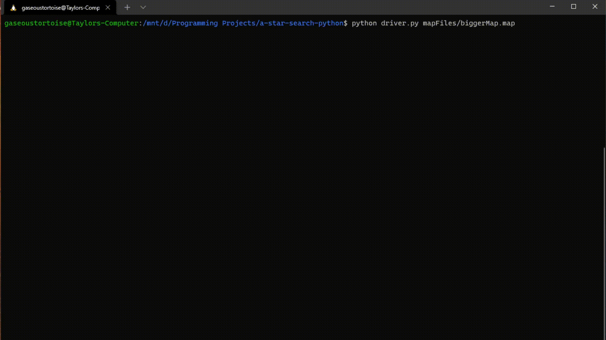

# a\* in Python

This is an implementation of the a\* pathfinding algorithm. I learned about this algorithm in using it in an assignment in university, and found it very interesting. I wanted to implement it as a more traditional pathfinding version, where it is actually finding a path.

## Usage

To run the program, you can do the following:
```sh
$ python driver.py <map_file>
```

This will run the program on a map file, which some examples are included as well.

## Creating Maps

Map Creation is fairly simple, x's are walls, an o is the player's starting point, and a 3 is the flag which the play needs to get to.

## Example Run


